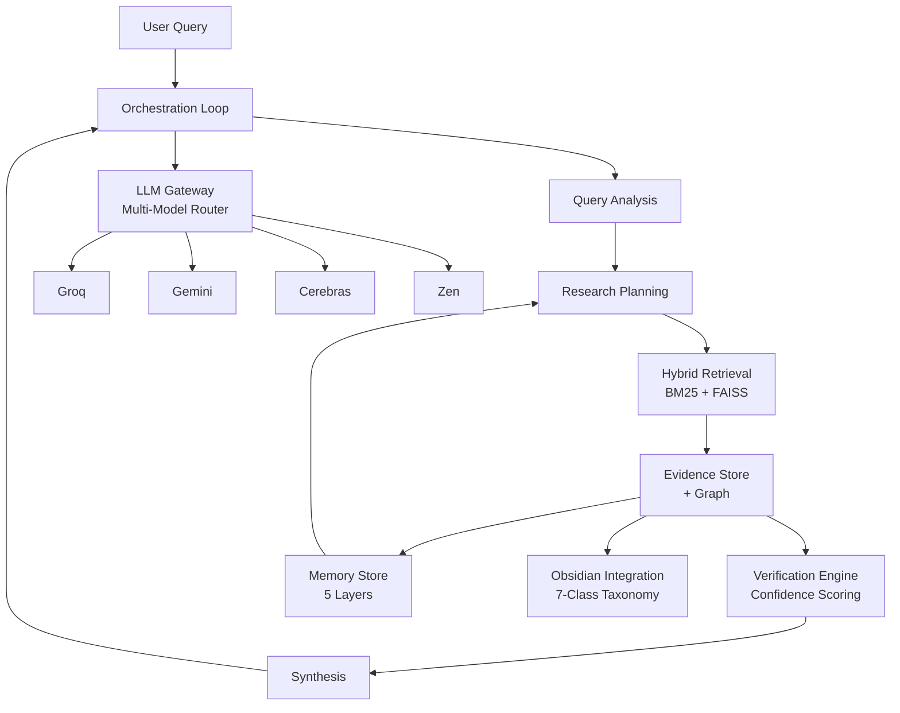

# ARGUS

**Adaptive Autonomous Evidence & Reasoning Intelligence System**

A cloud-LLM, local-control-plane research system that treats difficult
questions as evidence-backed investigations: adaptive hybrid retrieval, an
evidence graph with temporal reasoning, closed-loop verification, adaptive
research policy, multi-agent challenge, persistent memory, and an
Obsidian-integrated personal knowledge layer with guaranteed provenance.

[](https://www.python.org/downloads/)
[](LICENSE)
[](#testing--quality)

## Why ARGUS?

Basic RAG systems retrieve documents and generate answers. ARGUS goes further:

- **Evidence Graph** — entities, claims, and events with 8 edge types and temporal reasoning
- **Closed-Loop Verification** — every claim verified against source evidence with confidence scoring
- **Adaptive Research Policy** — stop conditions, question routing, evidence gap detection
- **Multi-Model Fabric** — explicit call-type routing across providers with fallback and quota tracking
- **Multi-Agent Challenge** — 5 specialized agent roles with debate and disagreement detection
- **Persistent Memory** — SQLite-based memory with 5 layers, promotion, and graph versioning
- **Obsidian Integration** — 7-class knowledge taxonomy, hypothesis research, vault-graph alignment

## Architecture



## Supported Providers & Models

ARGUS is provider-agnostic. Configure any combination of:

| Provider | Models | API Key Required |
|----------|--------|------------------|
| **Groq** | `openai/gpt-oss-120b`, `openai/gpt-oss-20b` | Yes (`GROQ_API_KEY`) |
| **Gemini** | `gemini-2.5-flash-lite`, `gemini-2.5-flash` | Yes (`GEMINI_API_KEY`) |
| **Cerebras** | `gpt-oss-120b` | Yes (`CEREBRAS_API_KEY`) |
| **OpenCode Zen** | `nemotron-3-ultra-free`, `big-pickle`, `mimo-v2.5-free` | Yes (`OPENCODE_ZEN_API_KEY`) |

Models are assigned per call type (query analysis, research planning, evidence extraction, synthesis, verification) via `configs/model_policy.yaml`. ARGUS never autonomously discovers or selects models — all assignments are explicit configuration.

## Setup

Requires Python 3.11+ (developed against 3.14).

```bash
# 1. Clone and create virtual environment
git clone https://github.com/armanojha/ARGUS.git
cd ARGUS
python -m venv .venv
source .venv/bin/activate  # Linux/macOS
# .venv\Scripts\Activate   # Windows PowerShell

# 2. Install dependencies
pip install -e ".[core,retrieval,graph,multimodal,ui,dev-test]"

# 3. Configure environment
cp .env.example .env
# Edit .env — add API keys as needed (GROQ_API_KEY / GEMINI_API_KEY /
# CEREBRAS_API_KEY for the LLM gateway). Tesseract is a system dependency
# for the OCR fallback.

# 4. Run the tests
python -m pytest tests/ -v
```

### Running the API

```bash
# Start the server
uvicorn app.api.main:app --reload

# Verify it's running
curl http://localhost:8000/health

# Query the orchestration loop
curl -X POST http://localhost:8000/api/v1/query \
  -H "Content-Type: application/json" \
  -d '{"query": "What is machine learning?"}'
```

### Ingesting Documents

```bash
# Ingest a document corpus
python scripts/ingest_corpus.py /path/to/documents

# Or ingest the Obsidian vault
python scripts/run_obsidian_vault.py /path/to/vault --all
```

### Running the Research UI

```bash
# Start the API (separate terminal), then open:
# http://localhost:8000/brain
```

The ARGUS Brain UI provides the unified interface: Research, Knowledge Base,
ARGUS Brain (memory), Documents, Evidence, Obsidian Brain, and Settings.

### Running Live LLM Tests

```bash
RUN_LIVE_LLM_TESTS=1 python -m pytest tests/test_provider_contract_live.py -v
```

## Configuration

| File | Purpose |
|------|---------|
| `.env` | API keys and environment variables (gitignored) |
| `configs/providers.yaml` | LLM provider configuration |
| `configs/model_policy.yaml` | Call-type routing and model assignment |
| `configs/retrieval_policy.yaml` | Retrieval behavior settings |
| `configs/obsidian.yaml` | Obsidian integration settings |

## Testing & Quality

| Check | Status |
|-------|--------|
| `pytest tests/ -v` | 559 passed, 20 skipped |
| `ruff check app/` | Clean |
| `mypy app/` | Passing |

## Roadmap

| Phase | Status |
|-------|--------|
| 00 Foundation | Complete |
| 01 Hybrid RAG | Complete |
| 02 Agentic RAG | Complete |
| 03 Evidence Graph | Complete |
| 04 Verification & Contradiction | Complete |
| 05 Obsidian Ingestion (MVP) | Complete |
| 06 Adaptive Research Policy | Complete |
| 07 Multi-Model Fabric | Complete |
| 08 Memory & Self-Evolution | Complete |
| 09 Obsidian Integration (full) | Complete |
| 10 Multi-Agent Challenge | Complete |
| 11 Multimodal Intelligence | Complete |
| 12 Research UI + Evaluation | Complete |

## Known Limitations

- Phase 10.2 disagreement-triggered retrieval detects disagreements; wiring back into the retriever is a follow-on enhancement
- Phase 11.5 chart extraction is a placeholder (deferred to a vision model)
- Web ingestion performs synchronous HTTP fetches
- Tesseract is required as a system dependency for OCR fallback

## Contributing

See [CONTRIBUTING.md](CONTRIBUTING.md) for guidelines.

## Security

See [SECURITY.md](SECURITY.md) for API key and data security guidance.

## License

[MIT License](LICENSE)
