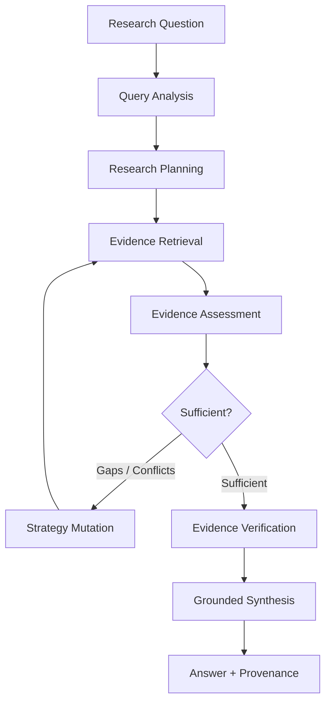
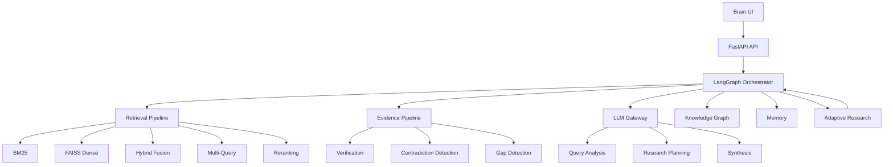
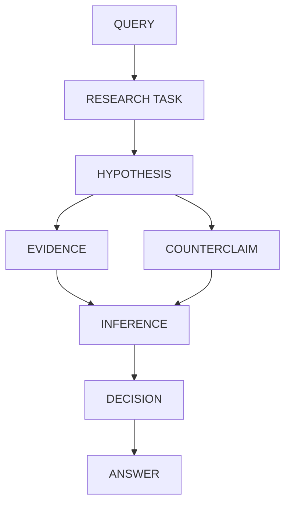

<p align="center">
  <h1 align="center">ARGUS</h1>
  <p align="center"><strong>Iterative, Evidence-Driven Research RAG</strong></p>
  <p align="center"><em>"Don't just retrieve. Investigate."</em></p>
</p>

<p align="center">
  <a href="#research-loop">Research Loop</a> ·
  <a href="#architecture">Architecture</a> ·
  <a href="#evaluation">Evaluation</a> ·
  <a href="#installation">Installation</a> ·
  <a href="#running-argus">Running</a>
</p>

---

ARGUS investigates complex research questions through iterative retrieval, evidence assessment, contradiction detection, adaptive research, verification, and grounded synthesis.

It is not a general-purpose RAG chatbot. It is an experimental research system built around a different idea: **retrieval should be an iterative investigation, not a single search followed by generation.**

---

## Why ARGUS Exists

Most RAG systems follow roughly:

```text
Question
   ↓
Retrieve
   ↓
Generate
   ↓
Answer
```

That works for straightforward questions. But difficult research questions are rarely that simple.

A serious question may require:

- Multiple searches with different strategies
- Evidence from different documents
- Verification of individual claims
- Identifying missing information
- Resolving contradictory evidence
- Revisiting the research strategy
- Deciding when enough evidence has actually been gathered

I built ARGUS as a way to move beyond learning RAG techniques individually and understand what happens when they are combined into a complete research pipeline.

---

## Traditional RAG vs ARGUS

| | Traditional RAG | ARGUS |
|---|---|---|
| **Retrieval** | Usually one pass | Iterative |
| **Query decomposition** | Optional | Research planning |
| **Retrieval strategy** | Mostly static | Query-adaptive |
| **Evidence assessment** | Often limited | Explicit |
| **Contradiction handling** | Often absent | Explicit |
| **Research adaptation** | Rare | Runtime strategy mutation |
| **Stopping** | Fixed / implicit | Evidence-based |
| **Provenance** | Citation-level | Evidence lineage |
| **Reasoning trace** | Usually hidden | Inspectable |
| **Visualization** | Usually absent | Brain UI |

---

## Research Loop

This is the most important diagram in this README. It shows how ARGUS investigates a question.



> **ARGUS does not assume that the first retrieval pass is sufficient. Assessment can change what the system searches for next.**

### Adaptive Research Behaviors

Three runtime strategy mutations are implemented in `app/orchestration/adaptive_research.py`:

**Conflict-driven research.** When unresolved critical contradictions remain and the query pattern requires it (e.g., `conflict`), ARGUS front-loads a contradiction-resolution query in the next research iteration.

**Gain-stall escalation.** When marginal information gain stalls (below threshold), retrieval depth increases for the next iteration, subject to a cap (top_k × 2, max 50).

**Gap prioritization.** High-priority evidence gaps detected by the assessor are promoted ahead of lower-priority research queries.

These are **runtime strategy mutations**, not configuration options. Each iteration's strategy is snapshotted and inspectable.

---

## Architecture



### Components

| Component | Purpose | Implementation |
|---|---|---|
| **FastAPI API** | HTTP endpoints, streaming, rate limiting | `app/api/` |
| **LangGraph Orchestrator** | Stateful research loop | `app/orchestration/` |
| **Hybrid Retrieval** | BM25 + FAISS with configurable fusion | `app/retrieval/` |
| **Evidence Verification** | Claim-support checking | `app/verification/` |
| **Contradiction Detection** | Pairwise conflict analysis | `app/orchestration/nodes.py` |
| **Adaptive Research** | Runtime strategy mutation | `app/orchestration/adaptive_research.py` |
| **Knowledge Graph** | Entity/claim/event graph | `app/graph/` |
| **Memory** | Persistent multi-layer memory | `app/memory/` |
| **LLM Gateway** | Multi-provider routing + fallback | `app/llm_gateway/` |
| **Brain UI** | Pipeline visualization + inspection | `app/ui/brain/` |

---

## Key Techniques

### Hybrid Retrieval

**What:** Combines lexical BM25 retrieval with dense FAISS vector retrieval.

**Why:** Exact terminology and semantic similarity behave differently across query types. BM25 excels at exact terms, names, and technical terminology. Dense retrieval captures semantic similarity when wording differs.

**How:** Configurable fusion weights per query pattern:

| Pattern | BM25 Weight | Dense Weight |
|---|---|---|
| `exact_term` | 0.7 | 0.3 |
| `conceptual` | 0.3 | 0.7 |
| `comparative` | 0.5 | 0.5 |
| `causal` | 0.4 | 0.6 |
| `procedural` | 0.6 | 0.4 |

### Multi-Query Research

**What:** Decomposes complex questions into evidence-targeting sub-queries executed with bounded concurrency.

**Why:** A single query rarely captures all evidence needs for a complex research question.

**How:** The planner generates sub-queries, each targeting a specific evidence requirement. Sub-queries run in parallel against the hybrid index.

### Evidence Verification

**What:** Evaluates whether collected evidence actually supports the research requirements, separate from retrieval relevance.

**Why:** A chunk can be relevant to a question without actually proving the claim being investigated.

**How:** Deterministic claim-support checking with four statuses:

| Status | Meaning |
|---|---|
| **Supported** | Evidence directly backs the claim |
| **Partial** | Some evidence supports, some is missing |
| **Contradicted** | Evidence conflicts with the claim |
| **Unsupported** | No relevant evidence found |

### Contradiction Detection

**What:** Identifies contradictions across evidence sources using entity overlap, metric overlap, numerical discrepancies, and temporal context.

**Why:** Not every disagreement between documents is a factual contradiction. Different values may both be correct if they refer to different time periods.

**How:** Deterministic pairwise analysis with five conflict categories:

```text
GENUINE_CONTRADICTION    Same entity, same metric, same timeframe, different values
DIFFERENT_TIMEFRAME      Data from different time periods
DIFFERENT_SOURCE         Different methodologies or scopes
POSSIBLE_CONTRADICTION   Uncertain — needs human review
IRRELEVANT_DIFFERENCE    Not a real conflict
```

### Adaptive Research

**What:** Changes research strategy based on what the system discovers during investigation.

**Why:** A fixed pipeline cannot respond to contradictions, evidence gaps, or diminishing returns.

**How:** Three runtime mutations applied between iterations:

1. **Conflict-driven** — Front-loads contradiction-resolution queries
2. **Gain-stall escalation** — Increases retrieval depth when gain stalls
3. **Gap-prioritized** — Promotes high-priority evidence gaps

### Research Stopping

**What:** Determines when to stop researching based on evidence sufficiency rather than a fixed number of passes.

**Why:** More retrieval is not automatically better. The system needs to know when it has enough.

**How:** Five deterministic stopping conditions evaluated in priority order:

```text
1. USER_EARLY_STOP          Explicit caller-requested stop
2. BUDGET_EXHAUSTED         Iteration/token ceiling reached
3. NEGLIGIBLE_EVIDENCE_GAIN New-evidence gain below threshold
4. CLAIMS_SUPPORTED         Claims supported above threshold
5. NO_UNRESOLVED_CONTRADICTION  No critical contradictions remain
```

### Provenance

**What:** Maintains evidence lineage from answer back to source.

**Why:** The goal is not merely to produce citations. It is to preserve the **lineage of evidence** behind the answer.

**How:** Every citation traces through:

```text
Answer → Claim → Evidence → Chunk → Document → Source
```

---

## Reasoning Graph

ARGUS maintains a graph representation of the research process.



The graph exists to make research provenance and reasoning inspectable. It connects to the Brain UI, which visualizes the research process:

```text
Research Runtime
      │
      ├── Evidence
      ├── Strategy
      ├── Decisions
      └── Reasoning Trace
              │
              ▼
          Brain UI
```

### Graph Node Types

| Type | Description |
|---|---|
| `Entity` | Extracted entity (person, organization, location, concept) |
| `Claim` | Factual proposition with subject-predicate-object |
| `Event` | Temporally anchored occurrence |
| `Document` | Source document |
| `Chunk` | Evidence chunk within a document |
| `Source` | Origin of a document |

### Graph Edge Types

| Type | Description |
|---|---|
| `supports` | Evidence supports a claim |
| `contradicts` | Evidence contradicts a claim |
| `derived_from` | Claim/entity derived from chunk |
| `valid_during` | Claim/event valid during time period |
| `relates_to` | Entity-entity or entity-claim relation |
| `mentions` | Chunk mentions entity |

---

## Brain UI

The Brain UI is not a chatbot interface. It exists to answer:

> **"What did ARGUS actually do to arrive at this answer?"**

The interface exposes the internal research process through interactive visualization.

| View | What It Shows |
|---|---|
| **Pipeline** | Research flow showing each processing stage |
| **Node Inspector** | Click any node to see inputs, outputs, and reasoning |
| **Evidence Trace** | Follow any citation back to source document |
| **Conflict Visualization** | Detected conflicts and associated evidence |
| **Reasoning Trace** | Question → Tasks → Evidence → Inference → Answer |
| **Knowledge Graph** | Interactive entity/claim/event graph |

**Open:** `http://localhost:8000/brain`

---

## Evaluation

ARGUS includes a fixed end-to-end evaluation benchmark designed to measure research-system behavior rather than simply counting tests.

| | |
|---|---|
| **Cases** | 38 evaluation queries |
| **Corpus** | 12-document fixed corpus |
| **Mode** | Deterministic (no LLM calls) |
| **Retrieval** | Real BM25 + FAISS with MiniLM embeddings |
| **Storage** | Isolated temporary benchmark storage |

### Results

| Metric | Result | Notes |
|---|---|---|
| **Recall@8** | 98.65% | Gold documents found in top 8 |
| **Precision@8** | 15.46% | Retrieval is broad, evidence selection narrows |
| **Gold-fact coverage** | 90.35% | Coverage of required facts |
| **Contradiction recall** | 100.00% | All contradictions detected |
| **Contradiction precision** | 7.89% | High false-positive rate (known limitation) |
| **Abstention accuracy** | 100.00% | Absent-info queries correctly abstained |
| **Avg retrieval latency** | 46.3 ms | Deterministic path only |

```
Recall@8                 ███████████████████░ 98.65%
Gold-fact coverage       █████████████████░░░ 90.35%
Contradiction recall     ████████████████████ 100.00%
Contradiction precision  █░░░░░░░░░░░░░░░░░░░  7.89%
Abstention accuracy      ████████████████████ 100.00%
```

> **These measurements evaluate specific system behaviors on a controlled benchmark. They are not a general measure of intelligence.**

The benchmark is intentionally fixed and deterministic. It measures specific components under controlled conditions. Live LLM evaluation is separated because provider availability, latency, rate limits, and model behavior introduce additional variables.

---

<details>
<summary><strong>Under the Hood: Query Analysis</strong></summary>

**What:** Classifies the query into one of 20+ patterns and extracts entities, temporal references, and risk characteristics.

**Why:** Different query patterns require different retrieval strategies, iteration budgets, and synthesis approaches.

**How:** LLM-based classification into patterns including: `exact_term`, `conceptual`, `comparative`, `causal`, `procedural`, `multi_hop`, `conflict`, `absent_info`, `adversarial`, and more.

The classification influences how the system should investigate the question, not just what to search for.

**Key file:** `app/orchestration/nodes.py` → `make_analyze_node()`

</details>

<details>
<summary><strong>Under the Hood: Research Planning</strong></summary>

**What:** Decomposes complex questions into targeted sub-queries, each targeting specific evidence needs.

**Why:** A single query rarely captures all evidence needs for a complex research question.

**How:** LLM-based planning with budget clamping. The planner generates sub-queries, identifies required evidence, establishes research budgets, and determines iteration limits.

For a complex question, the research plan may become:

```text
Original Question
       │
       ├── What is the phenomenon?
       ├── What caused it?
       ├── What evidence supports it?
       ├── What evidence contradicts it?
       └── What information is still missing?
```

**Key file:** `app/orchestration/nodes.py` → `make_plan_node()`

</details>

<details>
<summary><strong>Under the Hood: Hybrid Retrieval</strong></summary>

**What:** Combines BM25 lexical search with FAISS dense vector search.

**Why:** Exact terminology and semantic similarity behave differently across query types.

**How:**

- **BM25** — Term-frequency matching via `rank-bm25`. Good for exact keyword queries, names, technical terminology, identifiers, numerical queries.
- **FAISS** — Vector similarity via `faiss-cpu` + `sentence-transformers`. Good for semantic queries where wording differs.
- **Hybrid Fusion** — Combines both signals with configurable weights per query pattern.

Fusion weights can vary according to the detected query pattern, allowing the retrieval layer to behave differently for an exact-term lookup versus a conceptual question.

**Key files:** `app/retrieval/hybrid.py`, `app/retrieval/bm25.py`, `app/retrieval/vector.py`

</details>

<details>
<summary><strong>Under the Hood: Multi-Query Retrieval</strong></summary>

**What:** Executes multiple sub-queries against the hybrid index with bounded concurrency.

**Why:** Complex research questions often cannot be answered by one query.

**How:** Sub-queries from the research plan run in parallel (max 4 concurrent). Each targets a specific evidence requirement. Results merge into a single evidence pool with deduplication.

**Key file:** `app/retrieval/multi_query.py`

</details>

<details>
<summary><strong>Under the Hood: Reranking</strong></summary>

**What:** Separates candidate generation from final evidence selection.

**Why:** Initial retrieval is optimized for candidate generation, not final evidence quality.

**How:** Pluggable reranker architecture. Default is NoOp (returns candidates as-is). Any cross-encoder can be swapped in without restructuring the retrieval architecture.

**Key file:** `app/reranking/reranker.py`

</details>

<details>
<summary><strong>Under the Hood: Evidence Selection</strong></summary>

**What:** Selects a minimal high-coverage evidence subset for LLM context.

**Why:** Retrieving many relevant chunks does not mean sending all of them to the LLM.

**How:**

- Semantic deduplication (removes near-duplicate chunks)
- Diversity selection (ensures coverage across different aspects)
- Token budget enforcement (fits evidence into LLM context window)
- Minimum source diversity (ensures at least 2 distinct source documents)

The objective is to construct a **small but informative evidence set** rather than blindly maximizing retrieved context.

**Key file:** `app/retrieval/evidence_selector.py`

</details>

<details>
<summary><strong>Under the Hood: Evidence Verification</strong></summary>

**What:** Evaluates whether collected evidence actually supports planned claims.

**Why:** Finding relevant evidence and determining whether it supports a claim are different problems.

**How:** Deterministic claim-support checking with four statuses: Supported, Partial, Contradicted, Unsupported. Produces confidence scores for evidence coverage, source quality, cross-source agreement, and temporal relevance.

**Key files:** `app/verification/engine.py`, `app/verification/confidence.py`

</details>

<details>
<summary><strong>Under the Hood: Contradiction Detection</strong></summary>

**What:** Identifies contradictions across evidence sources using deterministic pairwise analysis.

**Why:** A research system should not treat every disagreement between documents as a factual contradiction.

**How:** Three detection methods:

1. **Negation pairs** — Detects opposing claims with topic coherence and entity overlap requirements
2. **Numerical discrepancies** — Compares extracted numbers near shared metrics with unit normalization ($, %, billion, million)
3. **Temporal context** — Extracts years and date ranges to distinguish historical differences from genuine contradictions

Unit normalization prevents false positives like `$2.1 billion` vs `$2,100 million`.

**Key file:** `app/orchestration/nodes.py` → `_detect_contradictions()`

</details>

<details>
<summary><strong>Under the Hood: Query-Aware Conflict Filtering</strong></summary>

**What:** Suppresses irrelevant conflicts based on what the user is asking about.

**Why:** Not every conflict discovered in a corpus matters to the current question.

**How:** When `ARGUS_CONFLICT_FILTERING_ENABLED=true`:

- Temporal differences are filtered if the query asks for current data
- Low-confidence conflicts are suppressed
- Metric-relevance filtering ensures only query-relevant conflicts surface

**Key file:** `app/orchestration/nodes.py` → `filter_contradictions_by_query()`

</details>

<details>
<summary><strong>Under the Hood: Adaptive Research</strong></summary>

**What:** Changes research strategy based on what the system discovers during investigation.

**Why:** A fixed pipeline cannot respond to contradictions, evidence gaps, or diminishing returns.

**How:** The `AdaptiveResearchPolicy` evaluates sufficiency after each iteration:

- **Sufficiency model** — Classifies evidence as INSUFFICIENT, MARGINAL, SUFFICIENT, STRONG, or CONFLICTED
- **Marginal gain calculator** — Detects diminishing returns from retrieval gain history
- **Pattern-specific policies** — Different query patterns have different iteration budgets and requirements
- **Strategy mutations** — Three runtime mutations applied between iterations:

```text
Iteration 1
───────────
Strategy A
   ↓
Retrieve
   ↓
Assess
   ↓
Discover: contradiction / gap / stalled gain
   ↓
Strategy Mutation
   ↓
Iteration 2
───────────
Strategy B
```

**Key file:** `app/orchestration/adaptive_research.py`

</details>

<details>
<summary><strong>Under the Hood: Research Sufficiency & Stopping</strong></summary>

**What:** Evaluates whether research should continue based on evidence state.

**Why:** More retrieval is not automatically better. The system needs mechanisms for evidence sufficiency and stopping.

**How:** Five deterministic stopping conditions evaluated in priority order:

1. **USER_EARLY_STOP** — Explicit caller-requested stop
2. **BUDGET_EXHAUSTED** — Iteration/token ceiling reached
3. **NEGLIGIBLE_EVIDENCE_GAIN** — New-evidence gain below threshold
4. **CLAIMS_SUPPORTED** — Claims supported above threshold (gated behind assessor verdict)
5. **NO_UNRESOLVED_CONTRADICTION** — No critical contradictions remain

Positive-completion conditions (4, 5) may only confirm the loop is done — they are gated behind the assessor's verdict. If the last assessment said more evidence is needed, these must not fire.

**Key file:** `app/orchestration/stopping.py`

</details>

<details>
<summary><strong>Under the Hood: Grounded Synthesis</strong></summary>

**What:** Generates answer from verified evidence with citations.

**Why:** The final answer should be generated from the **research state produced by the investigation**, not just from retrieved text.

**How:** LLM-based synthesis with evidence grounding, citation traceability, conflict awareness, safe degradation, and claim-level support. The synthesis layer produces bracket citations `[1]` `[2]` that trace back through evidence to source documents.

**Key file:** `app/orchestration/nodes.py` → `make_synthesize_node()`

</details>

<details>
<summary><strong>Under the Hood: Knowledge Graph</strong></summary>

**What:** Maintains a structured representation of relationships between evidence and extracted knowledge.

**Why:** Provides a richer representation than a simple document list, and gives the Brain UI something to visualize.

**How:** NetworkX MultiDiGraph with 6 node types (Entity, Claim, Event, Document, Chunk, Source) and 8 edge types (supports, contradicts, derived_from, valid_during, has_assumption, relates_to, mentions, instance_of). Exported as JSON for Brain UI visualization.

**Key files:** `app/graph/store.py`, `app/graph/extraction.py`

</details>

<details>
<summary><strong>Under the Hood: Memory</strong></summary>

**What:** Persistent multi-layer memory architecture backed by SQLite.

**Why:** Preserves information across research sessions and supports reuse of prior knowledge.

**How:** 6-layer architecture: working, long_term_knowledge, research_history, source_memory, user_memory, vault_memory. Deliberately separated from the core retrieval pipeline — the research engine does not depend on persistent memory to function.

**Key files:** `app/memory/store.py`, `app/memory/factory.py`

</details>

<details>
<summary><strong>Under the Hood: LLM Gateway</strong></summary>

**What:** Multi-provider LLM routing with fallback chains.

**Why:** Research logic should remain decoupled from individual model providers.

**How:** Different call types can be routed independently:

| Call Type | Purpose |
|---|---|
| `query_analysis` | Pattern detection |
| `research_planning` | Sub-query generation |
| `evidence_extraction` | Evidence summarization |
| `synthesis` | Answer generation |
| `verification` | Claim checking |

Provider fallback chains provide resilience when a provider is unavailable or rate-limited. Supported providers: Groq, Gemini, Cerebras, Z.ai, Zen, NVIDIA NIM.

**Key files:** `app/llm_gateway/routing/router.py`, `app/llm_gateway/providers/`

</details>

<details>
<summary><strong>Under the Hood: Configuration Modes</strong></summary>

**What:** Explicit operating modes that supply tested default configurations.

**Why:** The system accumulated ~9 independent opt-in behavioral flags. Modes collapse those into four tested configurations.

| Mode | Purpose |
|---|---|
| `baseline` | Historical/default behavior |
| `research` | Enables adaptive research |
| `verified` | Enables verification-oriented capabilities |
| `full` | Combines research, verification, memory, and multi-agent |

A mode only supplies defaults. Any flag set explicitly always wins over the mode. Experimental capabilities (multimodal, BGE-M3, Obsidian) remain opt-in rather than silently changing the baseline system.

**Key file:** `app/config.py`

</details>

---

## Project Structure

```text
ARGUS/
├── app/
│   ├── api/                    # FastAPI endpoints
│   ├── config.py               # Configuration and operating modes
│   ├── evidence/               # Evidence storage and provenance
│   ├── graph/                  # Evidence / reasoning graph
│   ├── ingestion/              # Document ingestion pipeline
│   ├── llm_gateway/            # Multi-provider LLM routing
│   ├── memory/                 # Persistent memory
│   ├── orchestration/          # LangGraph research workflow
│   ├── retrieval/              # BM25 + dense + hybrid retrieval
│   ├── reranking/              # Candidate reranking
│   ├── verification/           # Claim/evidence verification
│   └── ui/brain/               # Interactive Brain UI
├── benchmarks/
│   ├── eval_data/              # Fixed evaluation corpus
│   └── e2e_intelligence.py     # End-to-end benchmark
├── configs/                    # Provider and policy configurations
├── tests/                      # Unit + integration tests
├── docs/                       # Architecture and correctness docs
├── knowledge_base/             # Local research corpus
├── pyproject.toml
└── README.md
```

## Tech Stack

| Layer | Technology |
|---|---|
| Language | Python |
| API | FastAPI |
| Orchestration | LangGraph |
| Lexical Retrieval | BM25 |
| Dense Retrieval | FAISS + Sentence Transformers |
| Embeddings | `all-MiniLM-L6-v2` |
| Reranking | Pluggable reranker architecture |
| Evidence Store | SQLite |
| Knowledge Graph | NetworkX |
| Memory | SQLite |
| Frontend | HTML / JavaScript / D3 / Canvas |
| Testing | pytest |
| Linting | Ruff |
| CI | GitHub Actions |
| LLMs | Multi-provider gateway |

---

## Installation

### Requirements

- Python 3.11+
- At least one supported LLM provider API key for live research
- Git

### Clone

```bash
git clone https://github.com/armanojha/ARGUS.git
cd ARGUS
```

### Environment

```bash
python -m venv .venv
```

Windows:

```bash
.\\.venv\\Scripts\\activate
```

Install:

```bash
pip install -e ".[core,retrieval,graph,dev-test]"
```

Configure environment variables:

```bash
cp .env.example .env
```

Then add the required provider credentials.

---

## Running ARGUS

Start the API:

```bash
uvicorn app.api.main:app --reload
```

Then open:

```text
http://localhost:8000/brain
```

The Brain UI provides the primary interface for inspecting ARGUS's research pipeline.

---

## Testing

Run the complete test suite:

```bash
pytest tests/ -v
```

Run with coverage:

```bash
pytest tests/ --cov=app --cov-report=term-missing
```

Lint:

```bash
ruff check .
```

---

## End-to-End Evaluation

Run the deterministic intelligence benchmark:

```bash
python benchmarks/e2e_intelligence.py
```

Specify retrieval depth:

```bash
python benchmarks/e2e_intelligence.py --top-k 8
```

The benchmark operates against an isolated evaluation corpus and does not modify the normal knowledge base.

---

## Known Limitations

### Contradiction precision

The contradiction detector currently has high recall on the fixed benchmark but substantially lower precision (7.89%). This is a known research problem rather than a metric being hidden.

### Live evaluation

Full LLM evaluation is more variable than deterministic evaluation because of provider availability, model behavior, rate limits, latency, and token usage.

### Embedding model

`all-MiniLM-L6-v2` was selected for practicality and speed rather than maximum retrieval quality.

### Production hardening

ARGUS is not currently designed for large-scale distributed deployment, enterprise authentication, horizontal scaling, production-grade observability infrastructure, or guaranteed provider availability.

### Backend streaming

The backend processes queries synchronously. The Brain UI's progressive pipeline building is a UI simulation, not actual backend streaming.

### No persistent research history

Research results are not persisted. Each query is stateless.

---

## Research Direction

The long-term direction of ARGUS is not simply to keep adding RAG components. The interesting problem is:

> **How far can an evidence-grounded retrieval system go when research itself becomes an adaptive control loop?**

Areas of continued experimentation include:

- Stronger semantic contradiction verification
- Better research-policy adaptation
- Improved evidence selection
- Stronger reranking
- Deeper claim-level verification
- Richer reasoning traces
- Improved evaluation methodology
- More robust abstention
- Better source-quality modeling
- More informative research visualization

---

## Why the Project Is Called ARGUS

ARGUS is named after **Argus Panoptes**, the many-eyed watcher from Greek mythology. The metaphor fits the project's purpose:

**ARGUS observes the research process from multiple perspectives — retrieval, evidence, conflicts, verification, reasoning and provenance — rather than looking only at the final answer.**

---

## License

MIT License. See [`LICENSE`](LICENSE).

## Documentation

- [`docs/ARCHITECTURE.md`](docs/ARCHITECTURE.md) — Detailed system architecture
- [`docs/CORRECTNESS.md`](docs/CORRECTNESS.md) — Correctness and engineering evolution
- [`CHANGELOG.md`](CHANGELOG.md) — Project history
- [`CONTRIBUTING.md`](CONTRIBUTING.md) — Contribution guidelines

---

<p align="center">

**ARGUS**

*Research should be a process, not a single retrieval.*

</p>
